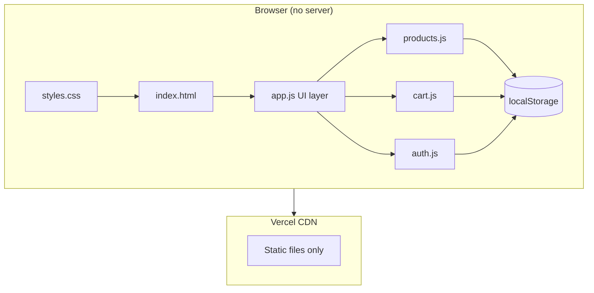
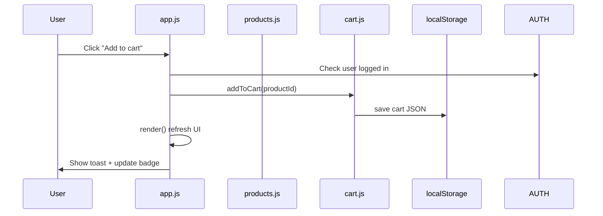
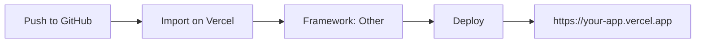

<div align="center">

<!-- Animated hero banner (SVG SMIL — works on GitHub) -->


<br/><br/>

<!-- Typing animation -->
<a href="https://git.io/typing-svg">
  
</a>

<br/>

[](https://developer.mozilla.org/en-US/docs/Web/HTML)
[](https://developer.mozilla.org/en-US/docs/Web/CSS)
[](https://developer.mozilla.org/en-US/docs/Web/JavaScript)
[](https://vercel.com)
[](LICENSE)

<p>
  
  
  
  
</p>

**A beautiful, zero-backend grocery cart built from the Shopping Cart SRS — perfect for coursework demos and free Vercel hosting.**

[Live demo](#-quick-start) · [Features](#-features) · [Architecture](#-architecture) · [Deploy](#-deploy-to-vercel) · [PDF guide](#-documentation-pdf) · [FAQ](#-faq)

</div>

---

## Table of contents

<!-- Animated flow diagram -->


<details open>
<summary><b>Jump to section</b></summary>

| | Section |
|---|---------|
| 1 | [Overview](#-overview) |
| 2 | [Features](#-features) |
| 3 | [Screens & UI](#-screens--ui) |
| 4 | [SRS mapping](#-srs-requirements-mapping) |
| 5 | [Architecture](#-architecture) |
| 6 | [Project structure](#-project-structure) |
| 7 | [Data model](#-data-model-localstorage) |
| 8 | [Quick start](#-quick-start) |
| 9 | [Usage guide](#-usage-guide) |
| 10 | [Admin panel](#-admin-panel) |
| 11 | [Deploy to Vercel](#-deploy-to-vercel) |
| 12 | [Documentation PDF](#-documentation-pdf) |
| 13 | [Customization](#-customization) |
| 14 | [FAQ](#-faq) |
| 15 | [Roadmap](#-roadmap) |

</details>

---

## Overview

**Simple Cart** is the **simplest possible** implementation of an online shopping cart that still satisfies a full **Software Requirements Specification (SRS)** — without MySQL, MongoDB, or any server-side code.

| Design goal | How we achieve it |
|-------------|-------------------|
| **Host anywhere** | Pure static files (`index.html` + CSS + JS) |
| **Persist data** | Browser `localStorage` (cart, catalog, user session) |
| **Pass SRS review** | Categories, products, cart CRUD, checkout summary, login UI, admin |
| **Look polished** | Responsive UI, slide-in cart, modals, toast notifications |
| **Teach the code** | `SimpleCart-Code-Guide.pdf` explains every file |


---

## Features

### Shopping experience

| Feature | Description | Animated? |
|---------|-------------|-----------|
| **Category tabs** | Filter by Vegetables, Fruits, Cakes, Biscuits, or view All | Tabs highlight on select |
| **Product cards** | Image, name, price, description, category badge | Grid reflows on resize |
| **Add to cart** | One click; requires sign-in | Toast slides up |
| **Cart drawer** | Slides in from the right | `transform` CSS transition |
| **Edit quantity** | `+` / `−` buttons or type a number | Total updates instantly |
| **Remove item** | × button per line | Line disappears + total recalculates |
| **Live total** | Sum of `price × quantity` | Updates on every change |
| **Checkout** | Order summary modal | Place order clears cart (demo) |

### Authentication (static demo)

| Provider | SRS requirement | Implementation |
|----------|-----------------|----------------|
| Google | Yes | Demo button → saves user to `localStorage` |
| Facebook | Yes | Demo button → saves user to `localStorage` |
| Passkey | Yes | Demo / WebAuthn-ready stub in `auth.js` |
| Admin | Separate login | Password form in login modal |

> **Note:** Real OAuth and Passkey **verification** need a backend. This project demonstrates the **UI and session flow** for static/Vercel hosting. See [FAQ](#-faq).

### Admin (optional SRS)

| Action | Where |
|--------|--------|
| Add product | Admin form at bottom of page |
| Edit product | Click **Edit** in admin table |
| Delete product | Click **Delete** (with confirm) |
| Persist catalog | `simplecart_products` in `localStorage` |

**Default admin password:** `admin123` (change in `js/auth.js` before public deploy).

---

## Screens & UI

```
┌─────────────────────────────────────────────────────────────┐
│  SimpleCart    Vegetables · Fruits · Cakes · Biscuits       │
│                              [ Login ]  [ Cart (3) ]        │
├─────────────────────────────────────────────────────────────┤
│  Shop by category                                           │
│  [ All ] [ Vegetables ] [ Fruits ] [ Cakes ] [ Biscuits ]   │
│                                                             │
│  ┌─────────┐  ┌─────────┐  ┌─────────┐  ┌─────────┐        │
│  │  img    │  │  img    │  │  img    │  │  img    │        │
│  │ Carrots │  │ Apples  │  │ Cake    │  │ Cookies │        │
│  │ $2.49   │  │ $4.49   │  │ $18.99  │  │ $4.99   │        │
│  │[Add]    │  │[Add]    │  │[Add]    │  │[Add]    │        │
│  └─────────┘  └─────────┘  └─────────┘  └─────────┘        │
└─────────────────────────────────────────────────────────────┘
                              │
                              ▼  (Cart button)
                    ┌──────────────────┐
                    │  Your cart    ×  │
                    │  Carrots  − 2 +  │
                    │  Total: $4.98    │
                    │  [ Checkout ]    │
                    └──────────────────┘
```

**Color palette** (from `css/styles.css`):

| Token | Value | Use |
|-------|-------|-----|
| `--accent` | `#2d6a4f` | Buttons, active tabs |
| `--bg` | `#f6f4ef` | Page background |
| `--surface` | `#ffffff` | Cards, modals |
| `--text` | `#1a1f16` | Body text |

---

## SRS requirements mapping

<details>
<summary><b>Click to expand full SRS checklist</b></summary>

| # | SRS requirement | Status | Location |
|---|-----------------|--------|----------|
| 1 | Display items with images and details | Done | `js/products.js`, `renderProducts()` |
| 2 | Multiple categories | Done | Vegetables, Fruits, Cakes, Biscuits |
| 3 | Add / edit / delete cart items | Done | `js/cart.js`, cart drawer UI |
| 4 | Dynamic total price | Done | `getCartTotal()` |
| 5 | Google login | Demo | `js/auth.js` → `#btn-google` |
| 6 | Facebook login | Demo | `js/auth.js` → `#btn-facebook` |
| 7 | Passkey login | Demo | `js/auth.js` → `#btn-passkey` |
| 8 | Admin login separate | Done | Admin form in login modal |
| 9 | Admin product CRUD | Done | `#admin-panel` |
| 10 | Checkout summary | Done | `#checkout-modal` |
| 11 | Payment gateway | Future | SRS §6 — not implemented |
| 12 | Mobile responsive | Done | `css/styles.css` grid + drawer |

</details>

---

## Architecture



### Request flow (all client-side)



### Why no database?

| Approach | Pros | Cons |
|----------|------|------|
| **This project (localStorage)** | Free hosting, instant deploy, no secrets | Data is per-browser only |
| **MySQL + API** | Shared data, real auth | Needs server, cost, complexity |

For **hosted coursework demos**, static + `localStorage` is ideal.

---

## Project structure

```
Simple-Cart/
│
├── index.html                 # App shell: header, shop, cart drawer, modals
├── css/
│   └── styles.css             # Layout, theme, animations, responsive rules
├── js/
│   ├── products.js            # Catalog defaults + load/save products
│   ├── cart.js                # Cart CRUD + totals
│   ├── auth.js                # User/admin sessions
│   └── app.js                 # Render loop + event handlers
├── docs/
│   ├── assets/                # Animated README SVGs (you are here)
│   └── generate_pdf.py        # Builds SimpleCart-Code-Guide.pdf
├── SimpleCart-Code-Guide.pdf  # Printable code reference
├── vercel.json                # Static hosting config
└── README.md                  # This file
```

### File responsibilities

<details>
<summary><b>index.html</b> — structure</summary>

- **Header:** logo, tagline, `#auth-area`, cart toggle with live count
- **Shop:** category tabs + `#product-grid`
- **Admin:** hidden section for product management
- **Cart drawer:** line items, total, checkout button
- **Modals:** login (social + admin), checkout summary
- **Scripts:** loaded in dependency order at bottom

</details>

<details>
<summary><b>js/products.js</b> — catalog</summary>

```javascript
// Default seed data (12 products, 4 categories)
const DEFAULT_PRODUCTS = [ /* ... */ ];

loadProducts()   // localStorage → array
saveProducts()   // array → localStorage
nextProductId()  // for admin "add new"
```

</details>

<details>
<summary><b>js/cart.js</b> — cart logic</summary>

```javascript
// Stored shape: [{ productId: 1, quantity: 2 }, ...]
addToCart(productId, products, qty)
updateCartQuantity(productId, quantity)
removeFromCart(productId)
getCartLines(products)  // enriched with name, price, lineTotal
getCartTotal(products)
```

</details>

<details>
<summary><b>js/auth.js</b> — sessions</summary>

```javascript
loginWithProvider('google' | 'facebook' | 'passkey', displayName)
loginAsAdmin(username)   // after password check in app.js
logout()
isAdmin(user)
```

</details>

<details>
<summary><b>js/app.js</b> — UI controller</summary>

- `render()` — single refresh for entire page state
- `renderProducts()`, `renderCart()`, `renderAdmin()`
- Modal open/close, checkout, admin form submit
- `escapeHtml()` — XSS-safe dynamic HTML

</details>

---

## Data model (localStorage)

| Key | Content | Example |
|-----|---------|---------|
| `simplecart_products` | Product array | `[{ id, category, name, price, description, image }]` |
| `simplecart_cart` | Cart lines | `[{ productId, quantity }]` |
| `simplecart_user` | Current user | `{ id, name, provider, role, loggedInAt }` |

**Product object:**

```json
{
  "id": 1,
  "category": "Vegetables",
  "name": "Fresh Carrots",
  "price": 2.49,
  "description": "Organic carrots, 1 lb bag.",
  "image": "https://images.unsplash.com/photo-..."
}
```

---

## Quick start

### Option A — Open directly

1. Clone the repo  
2. Double-click **`index.html`**  
3. Done

### Option B — Local server (recommended)

```bash
git clone https://github.com/YOUR_USERNAME/Simple-Cart.git
cd Simple-Cart
npx serve .
```

Open `http://localhost:3000` (or the port shown).

### Option C — VS Code Live Server

Right-click `index.html` → **Open with Live Server**.

---

## Usage guide

### 1. Browse & filter

1. Click category tabs: **All**, **Vegetables**, **Fruits**, **Cakes**, **Biscuits**
2. Scroll the product grid

### 2. Sign in & add items

1. Click **Login**
2. Choose **Google**, **Facebook**, or **Passkey** (demo)
3. Click **Add to cart** on any product
4. Watch the cart badge count animate up

### 3. Manage cart

1. Click **Cart** in the header
2. Use **−** / **+** or edit the number input
3. Click **×** to remove a line
4. Total updates automatically

### 4. Checkout

1. Click **Checkout** in the drawer
2. Review the **order summary**
3. Click **Place order** (demo — no payment per SRS future scope)

### 5. Reset data

Open DevTools → **Application** → **Local Storage** → clear keys starting with `simplecart_`.

---

## Admin panel

1. **Login** → scroll to **Admin login**
2. Username: anything (e.g. `Admin`)
3. Password: **`admin123`**
4. Scroll to **Admin — Product management**
5. Fill the form → **Save product**
6. Use **Edit** / **Delete** in the table

| Field | Required |
|-------|----------|
| Category | Yes |
| Name | Yes |
| Price | Yes |
| Description | Optional |
| Image URL | Optional (fallback image used) |

---

## Deploy to Vercel



| Step | Action |
|------|--------|
| 1 | Create a GitHub repository and push this folder |
| 2 | Go to [vercel.com/new](https://vercel.com/new) |
| 3 | Import your repository |
| 4 | **Framework Preset:** Other |
| 5 | **Root Directory:** `./` |
| 6 | Click **Deploy** |

No environment variables. No database connection strings.

Add your live URL to this README:

```markdown
**Live demo:** https://YOUR-PROJECT.vercel.app
```

---

## Documentation PDF

A **detailed code walkthrough** is included for exams and handoffs:

```bash
pip install fpdf2
python docs/generate_pdf.py
```

Output: **`SimpleCart-Code-Guide.pdf`** (project root).

Topics covered: SRS mapping, every file, `localStorage` keys, deploy steps, production upgrades.

---

## Customization

| What to change | File |
|----------------|------|
| Colors / fonts | `css/styles.css` → `:root` variables |
| Default products | `js/products.js` → `DEFAULT_PRODUCTS` |
| Admin password | `js/auth.js` → `ADMIN_PASSWORD` |
| Categories list | `js/products.js` → `CATEGORIES` + admin `<select>` in `index.html` |
| Store name | `index.html` → `.logo` text |

### Add a new category

1. Add to `CATEGORIES` in `js/products.js`
2. Add `<option>` in `#product-category` (`index.html`)
3. Add products with that `category` value

---

## FAQ

<details>
<summary><b>Why is login “demo” only?</b></summary>

Google, Facebook, and Passkey sign-in require **server-side token verification**. Static sites on Vercel cannot safely hold OAuth secrets. This project stores a **mock user** in `localStorage` so you can demo the full UX without a backend.

</details>

<details>
<summary><b>Where is my cart saved?</b></summary>

In **your browser only** (`simplecart_cart`). Clearing site data or using another device starts fresh.

</details>

<details>
<summary><b>Can I use this for production?</b></summary>

As a **prototype or assignment**, yes. For real e-commerce, add an API, database, real auth, and payment (see SRS future enhancements).

</details>

<details>
<summary><b>Images not loading?</b></summary>

Products use **Unsplash URLs**. You need internet access. Replace `image` fields with your own URLs in admin or `products.js`.

</details>

<details>
<summary><b>Do README animations work on GitHub?</b></summary>

Yes — SVG files in `docs/assets/` use **SMIL animations** and display when embedded with ``. The typing header uses [readme-typing-svg](https://github.com/DenverCoder1/readme-typing-svg).

</details>

---

## Roadmap

- [ ] Payment gateway (Stripe / PayPal)
- [ ] Order history & invoices
- [ ] Real OAuth backend (Node / serverless functions)
- [ ] Product recommendation section
- [ ] PWA offline support

---

## Contributing

1. Fork the repository  
2. Create a branch: `git checkout -b feature/my-feature`  
3. Commit: `git commit -m "Add my feature"`  
4. Push: `git push origin feature/my-feature`  
5. Open a Pull Request  

---

## License

MIT — use freely for learning and demos.

---

<div align="center">

### If this helped your project, consider starring the repo

**Built with care for SRS compliance and zero-ops hosting**


<br/><br/>


</div>
